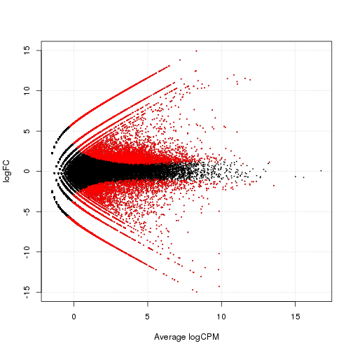

```
Adapted from

################
# Differential Gene Expression Analysis on the Desktop
#
# Bio-IT World Asia conference 2012, SC1
# June 5, 10:05–10:35
#
# Charles Plessy
#################
```

# Preparation

## Install programs available in Debian

```
sudo apt-get install bedtools bwa devscripts equivs git python-numpy samtools sra-toolkit r-bioc-edger r-cran-rggobi
```

## Install tagdust, and remove sequencer artefacts.

```
wget http://genome.gsc.riken.jp/osc/english/software/src/tagdust.tgz
tar xvf tagdust.tgz
(cd tagdust && make)
```

## Download and index the human genome.

```
wget http://hgdownload.cse.ucsc.edu/goldenPath/hg19/bigZips/chromFa.tar.gz
tar xvf chromFa.tar.gz
cat chr?.fa chr??.fa > hg19_male.fa
bwa index hg19_male.fa
```

## Install pysam for level1.py (trust me)

```
git clone git://anonscm.debian.org/debian-med/pysam.git
cd pysam
sudo mk-build-deps -r -i
debuild -us -uc -b
cd ..
sudo dpkg -i python-pysam_*_amd64.deb
sudo apt-get -f install

wget http://genome.gsc.riken.jp/plessy-20120605/level1.py 
```

## Download and install Paraclu

```
wget http://www.cbrc.jp/paraclu/archive/paraclu-9.zip
(cd paraclu-9/ && make)
```

# Download HeliScopeCAGE data from SRA.


```sh
wget ftp://ftp-trace.ncbi.nlm.nih.gov/sra/sra-instant/reads/ByExp/sra/DRX/DRX000/DRX000595/DRR000945/DRR000945.sra -O HeLa_1.sra
wget ftp://ftp-trace.ncbi.nlm.nih.gov/sra/sra-instant/reads/ByExp/sra/DRX/DRX000/DRX000596/DRR000946/DRR000946.sra -O HeLa_2.sra
wget ftp://ftp-trace.ncbi.nlm.nih.gov/sra/sra-instant/reads/ByExp/sra/DRX/DRX000/DRX000605/DRR000955/DRR000955.sra -O THP1_1.sra
wget ftp://ftp-trace.ncbi.nlm.nih.gov/sra/sra-instant/reads/ByExp/sra/DRX/DRX000/DRX000606/DRR000956/DRR000956.sra -O THP1_2.sra
```


# Convert to FASTQ format

(this takes time).


```sh
fastq-dump *sra
```

```
## Read 16909749 spots for HeLa_1.sra
## Written 16909749 spots for HeLa_1.sra
## Read 34257327 spots for HeLa_2.sra
## Written 34257327 spots for HeLa_2.sra
## Read 26994680 spots for THP1_1.sra
## Written 26994680 spots for THP1_1.sra
## Read 31108459 spots for THP1_2.sra
## Written 31108459 spots for THP1_2.sra
## Read 109270215 spots total
## Written 109270215 spots total
```


# Filter artefacts with TagDust.

HeliScope artefacts are TAGC repreats.


```sh
cat > tagc.fa <<__END__
>tagc
tagctagctagctagctagctagctagctagctagctagc
__END__

for FQ in *fastq
do tagdust -fasta tagc.fa $FQ -o $(basename $FQ .fastq).dusted.fa -a $(basename $FQ .fastq).rejected.fa
done
```


# Align the tags, filter and sort the alignments.


```sh
for FA in *.dusted.fa
do
  bwa aln  -t 8 hg19_male.fa -f $FA.sai $FA
  bwa samse     hg19_male.fa    $FA.sai $FA | samtools view -q20 -uS - | samtools sort - $(basename $FA .dusted.fa)
done
```


# Preapre an expression table.


```sh
level1.py -o bioit.l1.osc.gz *bam
```


# In `R`


```r
l1 <- read.table("bioit.l1.osc.gz", row.names = 1, head = TRUE)

THP1 <- c("raw.THP1_1", "raw.THP1_2")
HeLa <- c("raw.HeLa_1", "raw.HeLa_2")

with(l1, write.table(file = "for_paraclu.txt", data.frame(chrom = chrom, strand = strand, start.0base = start.0base, total = rowSums(l1[, c(HeLa, THP1)])), 
    col.names = FALSE, quote = FALSE, row.names = FALSE))
```


# Quit R and return to command line.

```
quit(save="yes")
```

# Cluster and filter


```bash
paraclu 0 for_paraclu.txt |
   paraclu-cut.sh -l 1000 > paraclu.txt
awk '{OFS="\t"}{print $1,$3,$4,$1":"$3"-"$4$2,$6,$2}' paraclu.txt |
   sort -k1,1 -k2,2n > paraclu.bed

# Create a correspondance table between TSS (single-nucleotide data) and clusters

zgrep -v \# bioit.l1.osc.gz | sed 1d | awk '{OFS="\t"}{print $2,$3,$4,$2":"$3"-"$4$5,"0",$5}' > bioit.bed
intersectBed -a bioit.bed -b paraclu.bed -wao -s | cut -f4,10 > l1-l2.txt
```


# In R again.

Count the number of tags per cluster.


```r
l1l2 <- read.table("l1-l2.txt", stringsAsFactors = FALSE)
colnames(l1l2) <- c("TSS", "Cluster")
l2 <- rowsum(l1[c(HeLa, THP1)], l1l2$Cluster)

# Pairwise plot of the samples, in log scale.

plot(log(l2))
```

 


# Plots the same to a file.

```
png('pairwise.png')
plot(log(l2))
dev.off()
```

# Digital expression analysis with edgeR


```r
library("edgeR")

l2.dge <- DGEList(counts = l2, group = c("HeLa", "HeLa", "THP1", "THP1"))
l2.dge <- calcNormFactors(l2.dge)
l2.dge <- estimateTagwiseDisp(l2.dge)
```

```
## Running estimateCommonDisp() on DGEList object before proceeding with estimateTagwiseDisp().
```

```r
l2.com <- exactTest(l2.dge, dispersion = "tagwise")
l2.detags <- rownames(l2.com$table[!decideTestsDGE(l2.com) == 0, ])

topTags(l2.com)
```

```
## Comparison of groups:  THP1-HeLa 
##                           logFC logCPM     PValue        FDR
## chr19:49838634-49838818+ 14.942  8.298 1.449e-119 6.663e-114
## chr17:79792838-79793022- 12.483  8.271 7.213e-110 1.658e-104
## chr6:26235210-26235221-  10.823  8.683 6.055e-107 9.281e-102
## chr16:31213522-31214350- 10.551  8.112 5.492e-106 6.314e-101
## chr6:26240615-26240630+  10.238  7.811 1.069e-103  9.835e-99
## chr19:51226534-51226815+ 10.558  8.117 4.326e-103  3.315e-98
## chr6:27841306-27841315-  12.432  8.219  8.235e-99  5.409e-94
## chr1:40420780-40420921+  10.502  7.678  6.879e-97  3.954e-92
## chr21:46340757-46340946-  9.784  7.660  4.547e-95  2.323e-90
## chr6:31553940-31554060+  11.474  7.264  1.068e-93  4.909e-89
```

```r

# M-A plot

plotSmear(l2.com, de.tags = l2.detags)
```

 


# Plot the same into a file.

```
png('edgeR.png')
plotSmear(l2.com, de.tags=l2.detags)
dev.off()
```
