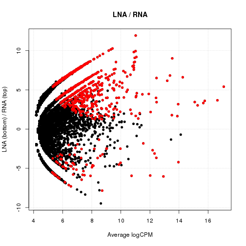

Digital expression comparison between nanoCAGE libraries testing variant template-switching oligonucleotides
============================================================================================================

This tutorial is an updated version of the supplementary material of the
manuscript _Comparison of RNA- and LNA-Hybrid Oligonucleotides in
Template-Switching Reactions_ ([Harbers et al.,
2013](http://dx.doi.org/10.1186/1471-2164-14-665)), that documented the
commands run to compare the expression levels of CAGE clusters in libraries
made with different template-switching oligonucleotides.  It is intended as an
example on how to compare shallow-sequenced nanoCAGE libraries.

See the main [README](../README.md) for general recommendations on how or what
to prepare before running this tutorial.

Table of contents
-----------------

 * [Data download and preparation](#data-prep)
 * [Artifact cleaning and alignment of the reads](#artifact-cleaning-and-alignment)
 * [Tag clustering](#clustering)
 * [Annotation](#annotation)
 * [Preparation for statistical analysis](#r-prep)
 * [Differential representation analysis](#differential-expression)
   * [LNA vs. RNA](#LNA-RNA)
   * [RNA vs. DNA](#RNA-DNA)
   * [DNA vs. LNA](#DNA-LNA)
 * [Output of the results as tables](#make-tables)
 * [Notes on the software](#notes-on-software)


<a id="data-prep">Data download and preparation</a>
---------------------------------------------------

### Information and download

The `DRR014141` library (`NCms10010` in the original publication)  was made
with total RNA from rat muscle.  It is comparing template-switching
oligonucleotides that end in RNA (r), DNA (d) or LNA (l) bases.  The
comparisons were multiplexed in triplicates.

The data is a single-end MiSeq run (ID: `121012_M00528_0022_AMS2003997-00050`)
of 4,682,200 reads.  The following commands download (`wget`) the data from
[DRA](http://trace.ddbj.nig.ac.jp/dra/index.html) (DDBJ's Sequence Read Archive)
and test its integrity (`md5sum`).


```bash
wget ftp://ftp.ddbj.nig.ac.jp/ddbj_database/dra/fastq/DRA001/DRA001167/DRX012672/DRR014141.fastq.bz2
echo "b0b3070fbbae0073507234d9048325ff  DRR014141.fastq.bz2" | md5sum -c
```

```
## DRR014141.fastq.bz2: OK
```


### De-multiplexing

The barcodes and sample IDs are associated in a whitespace-delimited file
called `DRR014141.id` containing the following.  The sample IDs encode the type
of template-switching oligonucleotide used, which each letter representing the
chemical nature of the third, second and first nucleotide, from the 3′ end.


```bash
cat <<__ID__ > DRR014141.id
rrr_1	CACTGA
rrr_2	GCTCTC
rrr_3	TCGCGT
ddd_1	ATCGTG
ddd_2	CACGAT
ddd_3	GTATAC
ddl_1	ACAGAT
ddl_2	CTGACG
ddl_3	GAGTGA
dll_1	AGTAGC
dll_2	GCTGCA
dll_3	TCGAGC
lll_1	ATCATA
lll_2	CGATGA
lll_3	TATAGC
__ID__
```


Samples were demultiplexed with [FASTX-toolkit](http://hannonlab.cshl.edu/fastx_toolkit/).
The number of extracted reads was collected in a file named `DRR014141.extracted.log`.


```bash
bzcat DRR014141.fastq.bz2 |
  fastx_barcode_splitter.pl --bcfile DRR014141.id --prefix DRR014141. --suffix .fq --bol --exact |
  sed 1d | cut -f1,2 |
  perl -ne 'print "extracted\t$_"' |
  grep -v -e unmatched -e total |
  tee DRR014141.extracted.log
```

```
## extracted	ddd_1	333255
## extracted	ddd_2	340917
## extracted	ddd_3	148290
## extracted	ddl_1	479148
## extracted	ddl_2	48278
## extracted	ddl_3	37851
## extracted	dll_1	111856
## extracted	dll_2	42939
## extracted	dll_3	55763
## extracted	lll_1	100226
## extracted	lll_2	89915
## extracted	lll_3	61455
## extracted	rrr_1	776221
## extracted	rrr_2	351372
## extracted	rrr_3	186395
```


### Trimming reads to 31 nt

The reads start with 6 bases of barcode, 8 bases of random fingerprint, 4 bases
of spacer, and 3 base of linker, that are all removed in the following command.
The reads were also trimmed in 3′ to ensure that the results were comparable
with a reference HiSeq run (not covered in this document).


```bash
for FASTQ in *.fq
do
  fastx_trimmer -f 22 -l 52 -Q33 < $FASTQ | sponge $FASTQ
done
```


The `sponge` command is from the [moreutils](http://joeyh.name/code/moreutils/) collection.

<a name="artifact-cleaning-and-alignment">Artifact cleaning and alignment of the reads</a>
------------------------------------------------------------------------------------------

### Removal of artifacts with TagDust

Download [TagDust](http://bioinformatics.oxfordjournals.org/content/25/21/2839)
and install it in the user's path.  See the main [README](../README.md) for details.


```bash
cat > tagdust.fa <<__TagDust__
>TS (before barcode)
TAGTCGAACTGAAGGTCTCCAGCA
>RT (without random bases)
TAGTCGAACTGAAGGTCTCCGAACCGCTCTTCCGATCT
>empty (TS linker + RT reverse-complemented)
TATAGGGAGATCGGAAGAGCGGTTCGGAGACCTTCAGTTCGACTA
__TagDust__

for ID in $( awk '{print $1}' DRR014141.id )
do
echo -ne "tagdust\t$ID\t"
tagdust tagdust.fa DRR014141.$ID.fq -o DRR014141.$ID.dusted.fastq 2>&1 |
  grep -e rejected | cut -f1
done | tee DRR014141.tagdust.log
```

```
## tagdust	rrr_1	13723
## tagdust	rrr_2	2625
## tagdust	rrr_3	1596
## tagdust	ddd_1	3691
## tagdust	ddd_2	3927
## tagdust	ddd_3	2432
## tagdust	ddl_1	8646
## tagdust	ddl_2	721
## tagdust	ddl_3	531
## tagdust	dll_1	1786
## tagdust	dll_2	680
## tagdust	dll_3	671
## tagdust	lll_1	1312
## tagdust	lll_2	1293
## tagdust	lll_3	296
```


### Alignment on the rat genome version 4

The following assumes the genome downloaded and indexed for BWA in
the current directory, using `rn4_male` as a base name.


```bash
GENOME=rn4_male
for FQ in *.dusted.fastq
do
  bwa aln -t8 $GENOME -f $(basename $FQ .dusted.fastq).sai $FQ
  bwa samse   $GENOME    $(basename $FQ .dusted.fastq).sai $FQ |
    samtools view -uS - |
    samtools sort - $(basename $FQ .dusted.fastq)
done
```


### Filter reads aligning to rDNA with rRNAdust

`rRNAdust` is available in the supplementary material at <http://genome.gsc.riken.jp/plessy-20130430/rRNAdust_1.02.tar.gz>.

Download the reference rRNA sequences at <http://www.ncbi.nlm.nih.gov/nuccore/V01270.1> and <http://www.ncbi.nlm.nih.gov/gene/170603>, and save them in a file called `rat_rDNA.fa`.


```bash
for ID in $( awk '{print $1}' DRR014141.id )
do
  echo -ne "rdna\t$ID\t"
  (rRNAdust -t8 rat_rDNA.fa DRR014141.$ID.bam | samtools view -bS  - 2> /dev/null | sponge DRR014141.$ID.bam) 2>&1 | sed 's/Excluded: //'
done | tee DRR014141.rdna.log
```

```
## rdna	rrr_1	239373
## rdna	rrr_2	112182
## rdna	rrr_3	56075
## rdna	ddd_1	56429
## rdna	ddd_2	78449
## rdna	ddd_3	29489
## rdna	ddl_1	178108
## rdna	ddl_2	10240
## rdna	ddl_3	6743
## rdna	dll_1	23612
## rdna	dll_2	10327
## rdna	dll_3	15254
## rdna	lll_1	21777
## rdna	lll_2	15454
## rdna	lll_3	12189
```


### Alignment statistics


```bash
for ID in $( awk '{print $1}' DRR014141.id )
do
  echo -ne "mapped\t$ID\t"
  (samtools flagstat DRR014141.$ID.bam | grep mapped | grep %) | cut -f1 -d' '
done | tee DRR014141.mapped.log
```

```
## mapped	rrr_1	469027
## mapped	rrr_2	211307
## mapped	rrr_3	113141
## mapped	ddd_1	259605
## mapped	ddd_2	242952
## mapped	ddd_3	109710
## mapped	ddl_1	265929
## mapped	ddl_2	34369
## mapped	ddl_3	28418
## mapped	dll_1	79426
## mapped	dll_2	27701
## mapped	dll_3	35436
## mapped	lll_1	68930
## mapped	lll_2	65139
## mapped	lll_3	43334
```


### Filter out possible strand-invasion tags

Strand invasion was described in [Tang et al, Nucl. Acids Res. (2013) 41
(3):e44](http://nar.oxfordjournals.org/content/41/3/e44), and is more frequent
in LNA- or DNA-based template-switching oligonucleotides.

The following commands need an updated version of the `find_strand_invasion.pl`
that was in Tang et al's supplementary material, where a new `-f` option is
added, with the same semantics as in `samtools`.  It is available at
<https://github.com/davetang/23180801>.


```bash
ERRORS=2
for BAM in DRR014141.???_?.bam
do
  find_strand_invasion.pl -f $BAM -g rn4_male.fa -e $ERRORS -s TATA
done
for ID in $( awk '{print $1}' DRR014141.id )
do
  echo -ne "strand-invasion-$ERRORS\t$ID\t"
  (samtools flagstat DRR014141.${ID}_nw_${ERRORS}_??????_removed_sorted.bam | grep mapped | grep %) | cut -f1 -d' '
done | tee DRR014141.strand-invasion-$ERRORS.log
```

```
## strand-invasion-2	rrr_1	51979
## strand-invasion-2	rrr_2	20470
## strand-invasion-2	rrr_3	11137
## strand-invasion-2	ddd_1	201479
## strand-invasion-2	ddd_2	172866
## strand-invasion-2	ddd_3	82123
## strand-invasion-2	ddl_1	130483
## strand-invasion-2	ddl_2	15228
## strand-invasion-2	ddl_3	16489
## strand-invasion-2	dll_1	39596
## strand-invasion-2	dll_2	9538
## strand-invasion-2	dll_3	13259
## strand-invasion-2	lll_1	27204
## strand-invasion-2	lll_2	24179
## strand-invasion-2	lll_3	14127
```


<a name="clustering">Tag clustering</a>
---------------------------------------

Level 1 clusters are single-nucleotide resolution data representing the 5′ ends
of the CAGE tags.  Level 2 clusters are groups of level 1 clusters that are
separated by 20 or less nucleotides.

The `level1.py` and `level2.py` scripts implement tag clustering like in the
[FANTOM3](http://fantom.gsc.riken.jp/3/) and
[FANTOM4](http://fantom.gsc.riken.jp/4/) projects, and are available at
<http://genome.gsc.riken.jp/plessy-20130430/PromoterPipeline_20130430.tar.gz>.

They output their results in Order Switchable Column
([OSC](http://sourceforge.net/projects/osctf/)) format, where each line is a
cluster, and each library gives one column counting the tags in the clusters,
and another column where the counts are normalised in parts per million.

See also [Carninci et al., Nature Genetics 38
626-635 (2006)](http://www.nature.com/ng/journal/v38/n6/full/ng1789.html) and
[Suzuki et al., Nature Genetics 41 553-562
(2009)](http://www.nature.com/ng/journal/v41/n5/full/ng.375.html) for original
examples of CAGE tag clustering.


```bash
level1.py -o DRR014141.l1.osc.gz -F 516 \
  DRR014141.???_?.bam \
  DRR014141.???_?_nw_?_??????_filtered_sorted.bam

level2.py -o DRR014141.l2.osc -t 0 DRR014141.l1.osc.gz
gzip DRR014141.l2.osc
```


The resulting file `DRR014141.l1.osc.gz` can be loaded in the
[Zenbu](http://fantom.gsc.riken.jp/zenbu/) system to browse the alignments on
the rat genome.

<a name="annotation">Annotation</a>
-----------------------------------

### Preparation of the reference files.

Data from ENSEMBL 69 were retrieved via
[BioMart](http://oct2012.archive.ensembl.org/biomart/martview/), with the following XML query.
Note that `external_gene_id` is called _Associated Gene Name_ in the web
interface.

```
<?xml version="1.0" encoding="UTF-8"?>
<!DOCTYPE Query>
<Query  virtualSchemaName = "default" formatter = "TSV" header = "0" uniqueRows = "0" count = "" datasetConfigVersion = "0.6" >
			
	<Dataset name = "rnorvegicus_gene_ensembl" interface = "default" >
		<Attribute name = "ensembl_gene_id" />
		<Attribute name = "ensembl_transcript_id" />
		<Attribute name = "chromosome_name" />
		<Attribute name = "strand" />
		<Attribute name = "external_gene_id" />
		<Attribute name = "transcript_start" />
		<Attribute name = "transcript_end" />
		<Attribute name = "gene_biotype" />
		<Attribute name = "exon_chrom_start" />
		<Attribute name = "exon_chrom_end" />
	</Dataset>
</Query>
```

Convert coordinates to gene names


```bash
cat mart_export.txt | 
  sed -e 1d -e 's|\t\t|\tno_symbol\t|'           |
  awk '{OFS="\t"} {print $3, $6, $7, $5, 0, $4}' |
  grep -v ^[JA]                                  |
  uniq                                           |
  sed -e 's/-1$/-/'                              \
      -e 's/1$/+/'                               \
      -e 's/^/chr/'                              |
  sort -k1,1 -k2,2n                              \
  > rn4_male.symbols.bed


### Gene symbols
```

```bash
zcat DRR014141.l1.osc.gz | grep -v \# | sed 1d | awk '{OFS="\t"}{print $2, $3, $4, "l2", "1000", $5}' > DRR014141.l1.bed
zcat DRR014141.l2.osc.gz | grep -v \# | sed 1d | awk '{OFS="\t"}{print $2, $3, $4, "l2", "1000", $5}' > DRR014141.l2.bed
zcat DRR014141.l2.osc.gz | grep -v \# | sed 1d | awk '{OFS="\t"}{print $2, $3, $4, "l2", "1000", $5}' > DRR014141.l2.bed

bedtools intersect -a DRR014141.l2.bed -b rn4_male.symbols.bed -s -loj |
  awk '{OFS="\t"}{print $1":"$2"-"$3$6,$10}' | 
  bedtools groupby -g 1 -c 2 -o distinct > DRR014141.l2.genes
```


### Repeated elements

Download the repeatmasker track from the [UCSC genome browser](http://genome.ucsc.edu) and save it in a file called `rn4_male.repeatmasker.bed`.


```bash
bedtools intersect -a DRR014141.l2.bed -b rn4_male.repeatmasker.bed -s -loj |
  awk '{OFS="\t"}{print $1":"$2"-"$3$6,$10}' |
  bedtools groupby -g 1 -c 2 -o distinct > DRR014141.l2.rmsk
```


<a name="r-prep">Preparation for statistical analysis</a>
---------------------------------------------------------

The following commands are run in the [`R` package for statistical computing](http://www.r-project.org/).

### Load the data.

The oscR library is available at <https://github.com/charles-plessy/oscR>.

The following commands load the level 1 and 2 clusters into data frames where
the column names correspond to the sample IDs defined above.


```r
library(oscR)

l1 <- read.osc("DRR014141.l1.osc.gz", drop.coord = T, drop.norm = T)
l2 <- read.osc("DRR014141.l2.osc.gz", drop.coord = T, drop.norm = T)

colnames(l1) <- sub("raw.DRR014141.", "", colnames(l1))
colnames(l2) <- sub("raw.DRR014141.", "", colnames(l2))

colnames(l1) <- sub("_......_filtered_sorted", "", colnames(l1))
colnames(l2) <- sub("_......_filtered_sorted", "", colnames(l2))
```


### Organise the data.

The following commands defined convenient shortcuts to manipulates groups of
libraries. The presence of `nw_2` in the names indicate that strand-invasion
artifacts have been removed.


```r
ddd <- c("ddd_1", "ddd_2", "ddd_3")
ddl <- c("ddl_1", "ddl_2", "ddl_3")
dll <- c("dll_1", "dll_2", "dll_3")
lll <- c("lll_1", "lll_2", "lll_3")
rrr <- c("rrr_1", "rrr_2", "rrr_3")
all <- c(rrr, lll, dll, ddl, ddd)

ddd_nw_2 <- c("ddd_1_nw_2", "ddd_2_nw_2", "ddd_3_nw_2")
ddl_nw_2 <- c("ddl_1_nw_2", "ddl_2_nw_2", "ddl_3_nw_2")
dll_nw_2 <- c("dll_1_nw_2", "dll_2_nw_2", "dll_3_nw_2")
lll_nw_2 <- c("lll_1_nw_2", "lll_2_nw_2", "lll_3_nw_2")
rrr_nw_2 <- c("rrr_1_nw_2", "rrr_2_nw_2", "rrr_3_nw_2")
all_nw_2 <- c(rrr_nw_2, lll_nw_2, dll_nw_2, ddl_nw_2, ddd_nw_2)
```


```r
TPM <- function(clusters) {
    clusters.tpm <- data.frame(prop.table(as.matrix(clusters), 2) * 1e+06)
    colnames(clusters.tpm) <- colnames(clusters)
    return(clusters.tpm)
}

L2 <- TPM(l2)

L2.means <- data.frame(ddd = apply(L2[, ddd], 1, mean), ddl = apply(L2[, ddl], 1, mean), dll = apply(L2[, dll], 1, mean), lll = apply(L2[, lll], 1, mean), 
    rrr = apply(L2[, rrr], 1, mean))

L2.means_nw_2 <- data.frame(ddd = apply(L2[, ddd_nw_2], 1, mean), ddl = apply(L2[, ddl_nw_2], 1, mean), dll = apply(L2[, dll_nw_2], 1, mean), lll = apply(L2[, 
    lll_nw_2], 1, mean), rrr = apply(L2[, rrr_nw_2], 1, mean))

L2.sd <- data.frame(ddd = apply(L2[, ddd], 1, sd), ddl = apply(L2[, ddl], 1, sd), dll = apply(L2[, dll], 1, sd), lll = apply(L2[, lll], 1, sd), rrr = apply(L2[, 
    rrr], 1, sd))
```


### Annotation of the results


```r
genesymbols <- read.table("DRR014141.l2.genes", col.names = c("cluster", "symbol"))
rownames(genesymbols) <- genesymbols$cluster
genesymbols$rmsk <- read.table("DRR014141.l2.rmsk", col.names = c("cluster", "rmsk"))[, "rmsk"]
```


<a name="differential-expression">Differential representation analysis<a>
-------------------------------------------------------------------------

Statistical comparisons using [edgeR](http://www.bioconductor.org/packages/release/bioc/html/edgeR.html).


```r
library(edgeR)
```


The following plots represent:

 * the multidimensional scaling of the samples,
   where spatial separation between the two sets of triplicates indicates that the
   factor that is compared (type of template-switching oligonucleotide) introduces
   more differences that the simple technical fluctuations,

 * the expression levels of the CAGE clusters as a M-A plot, where dots in red are clusters
   significantly enriched in one type of libraries.  Vertical distance from the
   horizontal midline represent the amplitude of the differences, and distance on
   the horizontal axis represents the average strength of expression.

The following comparisons show the difference (or lack of it) between
non-filtered and filtered data, and then explore the filtered data in more
details.

### <a name='LNA-RNA'>LNA vs. RNA</a>


```r
x <- DGEList(counts = l2[, c(lll, rrr)], group = c(rep("lll", 3), rep("rrr", 3)), remove.zeros = TRUE)
```

```
## Removing 114680 rows with all zero counts.
```

```r
x <- calcNormFactors(x)
x <- estimateCommonDisp(x)
x <- estimateTagwiseDisp(x)
x.com <- exactTest(x)
lr <- x
lr.com <- x.com
plotMDS(lr)
```

 

```r
plotSmear(lr.com, de.tags = rownames(lr.com)[decideTestsDGE(lr.com) != 0], cex = 0.8, main = "LNA / RNA", ylab = "LNA (bottom) / RNA (top)")
```

 

```r

x <- DGEList(counts = l2[, c(lll_nw_2, rrr_nw_2)], group = c(rep("lll_nw_2", 3), rep("rrr_nw_2", 3)), remove.zeros = TRUE)
```

```
## Removing 123000 rows with all zero counts.
```

```r
x <- calcNormFactors(x)
x <- estimateCommonDisp(x)
x <- estimateTagwiseDisp(x)
x.com <- exactTest(x)
lr_nw_2 <- x
lr_nw_2.com <- x.com
plotMDS(lr_nw_2)
```

 

```r
plotSmear(lr_nw_2.com, de.tags = rownames(lr_nw_2.com)[decideTestsDGE(lr_nw_2.com) != 0], cex = 0.8, main = "LNA / RNA (filtered)", ylab = "LNA (bottom) / RNA (top)")
```

 


```r
lr_nw_2.up <- sum(decideTestsDGE(lr_nw_2.com) > 0)
lr_nw_2.down <- sum(decideTestsDGE(lr_nw_2.com) < 0)
```


866 clusters were enriched and 44 were depleted in RNA
libraries compared to LNA.  The top 100 stronger fold changes in each direction are shown below.


```r
# Summary of the top 100 clusters enriched in RNA libraries.
summary(merge(subset(topTags(lr_nw_2.com, Inf)$table, logFC > 0)[1:100, ], genesymbols[, -1], by = 0, sort = FALSE))
```

```
##   Row.names             logFC           logCPM          PValue              FDR               symbol        rmsk   
##  Length:100         Min.   : 2.03   Min.   : 7.27   Min.   :0.00e+00   Min.   :0.00e+00   .      :40   .      :86  
##  Class :AsIs        1st Qu.: 4.93   1st Qu.: 8.07   1st Qu.:0.00e+00   1st Qu.:0.00e+00   Myh2   : 3   7SLRNA :11  
##  Mode  :character   Median : 6.55   Median : 8.86   Median :0.00e+00   Median :0.00e+00   Eno3   : 2   GC_rich: 1  
##                     Mean   : 6.45   Mean   : 9.69   Mean   :1.03e-15   Mean   :1.47e-12   Myl1   : 2   L1MCa  : 1  
##                     3rd Qu.: 7.96   3rd Qu.:11.12   3rd Qu.:1.24e-16   3rd Qu.:2.22e-13   Acat1  : 1   L1_Rat1: 1  
##                     Max.   :11.82   Max.   :16.94   Max.   :1.11e-14   Max.   :1.50e-11   Aco2   : 1   4.5SRNA: 0  
##                                                                                           (Other):51   (Other): 0
```

```r
# Top 15 clusters enriched in RNA libraries.
merge(subset(topTags(lr_nw_2.com, Inf)$table, logFC > 0)[1:15, ], genesymbols[, -1], by = 0, sort = FALSE)
```

```
##                    Row.names  logFC logCPM     PValue        FDR symbol   rmsk
## 1      chr5:5309920-5309978-  9.729 11.305 4.054e-109 5.622e-104      . 7SLRNA
## 2    chr8:62243583-62243658+  8.946 11.343  2.517e-87  1.745e-82      . 7SLRNA
## 3    chr9:65727648-65727774-  6.269 12.740  7.765e-76  3.556e-71   Myl1      .
## 4   chr11:68375411-68375528-  7.333 11.185  1.026e-75  3.556e-71      . 7SLRNA
## 5   chr12:22851453-22851493-  7.585 11.187  1.724e-64  4.781e-60      . 7SLRNA
## 6    chr3:70682541-70682599+  9.607 11.185  6.080e-61  1.405e-56      . 7SLRNA
## 7    chr6:91117279-91117393+  8.852 11.247  1.312e-60  2.599e-56      . 7SLRNA
## 8    chrX:54985894-54985915+ 11.819 11.312  3.036e-55  5.262e-51      . 7SLRNA
## 9  chr2:145713673-145713772+  2.927 14.250  1.063e-53  1.637e-49      .      .
## 10         chrM:12334-13779+  2.595 12.261  1.519e-53  2.106e-49      .      .
## 11 chr1:202745119-202745217+  6.467 14.539  1.020e-51  1.286e-47      .      .
## 12   chr7:68333299-68333423-  8.331 11.253  3.925e-51  4.535e-47      . 7SLRNA
## 13   chr2:77482169-77482291+  8.263 11.194  2.203e-48  2.350e-44 Znf622 7SLRNA
## 14  chr10:59473911-59473930+  7.875 11.178  2.466e-47  2.443e-43      . 7SLRNA
## 15   chr1:85599001-85599082+  6.291  8.801  1.865e-39  1.724e-35  Hspb6      .
```

```r
# Summary of the top 100 clusters enriched in LNA libraries.
summary(merge(subset(topTags(lr_nw_2.com, Inf)$table, logFC < 0)[1:100, ], genesymbols[, -1], by = 0, sort = FALSE))
```

```
##   Row.names             logFC           logCPM          PValue              FDR             symbol                  rmsk   
##  Length:100         Min.   :-7.96   Min.   : 5.37   Min.   :0.000000   Min.   :0.0000   .      :66   .                :50  
##  Class :AsIs        1st Qu.:-5.46   1st Qu.: 5.72   1st Qu.:0.000056   1st Qu.:0.0108   Armc2  : 3   (CAGAGA)n        :31  
##  Mode  :character   Median :-4.46   Median : 6.12   Median :0.000420   Median :0.0609   Nrd1   : 2   GA-rich          : 5  
##                     Mean   :-4.41   Mean   : 6.70   Mean   :0.000874   Mean   :0.1001   Sesn1  : 2   (AGTAG)n,(TAGGG)n: 1  
##                     3rd Qu.:-3.50   3rd Qu.: 7.15   3rd Qu.:0.001418   3rd Qu.:0.1664   Acbd3  : 1   B1_Mur3          : 1  
##                     Max.   :-1.20   Max.   :12.55   Max.   :0.003802   Max.   :0.3682   Chordc1: 1   B1_Rn            : 1  
##                                                                                         (Other):25   (Other)          :11
```


Positive fold change indicate enrichment in RNA libraries.  The 7SLRNA hits
are concentrated at the top of the list.  LNA libraries are enriched for hits
on CAGAGA repeats, even beyond the significance level (FDR) of the statistical
comparison.


```r
library(reshape)
```

```
## Loading required package: plyr
```

```
## Attaching package: 'reshape'
```

```
## The following objects are masked from 'package:plyr':
## 
## rename, round_any
```

```r
library(ggplot2)
srprna <- rownames(subset(genesymbols, rmsk == "7SLRNA"))
srprna.expression <- melt(L2[srprna, c(rrr_nw_2, ddd_nw_2, lll_nw_2)], measure.vars = c(rrr_nw_2, ddd_nw_2, lll_nw_2))
for (group in c("ddd", "lll", "rrr")) srprna.expression[grep(group, srprna.expression$variable), "group"] <- group
srprna.expression$group <- reorder(factor(srprna.expression$group), srprna.expression$value, function(x) sum(x) * -1)
qplot(data = srprna.expression, value, reorder(variable, value, sum), xlab = "Parts per million", ylab = "Library", main = "Expression levels of 7SL RNA genes", 
    col = group)
```

 


The measured expression of 7SL RNA is strongest in RNA libraries, strong in DNA
libraries, and weak in LNA libraries.

### <a name='RNA-DNA'>RNA vs. DNA</a>


```r
x <- DGEList(counts = l2[, c(rrr, ddd)], group = factor(c(rep("rrr", 3), rep("ddd", 3)), levels = c("rrr", "ddd")), remove.zeros = TRUE)
```

```
## Removing 89641 rows with all zero counts.
```

```r
x <- calcNormFactors(x)
x <- estimateCommonDisp(x)
x <- estimateTagwiseDisp(x)
x.com <- exactTest(x)
rd <- x
rd.com <- x.com
plotMDS(x)
```

 

```r
plotSmear(rd.com, de.tags = rownames(rd.com)[decideTestsDGE(rd.com) != 0], cex = 0.8, main = "RNA / DNA", ylab = "RNA (bottom) / LNA (top)")
```

 

```r

x <- DGEList(counts = l2[, c(rrr_nw_2, ddd_nw_2)], group = factor(c(rep("rrr_nw_2", 3), rep("ddd_nw_2", 3)), levels = c("rrr_nw_2", "ddd_nw_2")), remove.zeros = TRUE)
```

```
## Removing 106919 rows with all zero counts.
```

```r
x <- calcNormFactors(x)
x <- estimateCommonDisp(x)
x <- estimateTagwiseDisp(x)
x.com <- exactTest(x)
plotMDS(x)
```

 

```r
rd_nw_2 <- x
rd_nw_2.com <- x.com
plotSmear(rd_nw_2.com, de.tags = rownames(rd_nw_2.com)[decideTestsDGE(rd_nw_2.com) != 0], cex = 0.8, main = "RNA / DNA (filtered)", ylab = "RNA (bottom) / DNA (top)")
```

 


626 clusters were enriched and 87 were depleted in RNA
libraries compared to DNA.

The majority of the clusters in the top 100 enriched in the RNA libraries did
not overlap with repeat elements, and were overlapping with loci having gene
symbols.  In contrast, the majority of the top 100 clusters enriched in the DNA
libraries did not overlap with known genes.  A mild enrichment for GGGTG
simple repeats is noted.


```r
# Summary of the top 100 clusters enriched in DNA libraries.
summary(merge(subset(topTags(rd_nw_2.com, Inf)$table, logFC > 0)[1:100, ], genesymbols[, -1], by = 0, sort = FALSE))
```

```
##   Row.names             logFC           logCPM          PValue              FDR                   symbol                rmsk   
##  Length:100         Min.   : 1.41   Min.   : 5.21   Min.   :0.00e+00   Min.   :0.00000   .           :85   .              :81  
##  Class :AsIs        1st Qu.: 4.70   1st Qu.: 5.60   1st Qu.:0.00e+00   1st Qu.:0.00001   F1LY53_RAT  : 5   (GGGTG)n       : 4  
##  Mode  :character   Median : 5.76   Median : 6.23   Median :3.70e-06   Median :0.00145   F1M1V3_RAT  : 2   GA-rich        : 3  
##                     Mean   : 5.84   Mean   : 6.84   Mean   :8.09e-05   Mean   :0.01749   D3ZWL6_RAT  : 1   G-rich         : 3  
##                     3rd Qu.: 6.81   3rd Qu.: 7.63   3rd Qu.:1.07e-04   3rd Qu.:0.02649   Kpnb1       : 1   (CAGA)n,GA-rich: 2  
##                     Max.   :10.54   Max.   :13.73   Max.   :5.20e-04   Max.   :0.09911   LOC100364794: 1   (CAGA)n        : 1  
##                                                                                          (Other)     : 5   (Other)        : 6
```

```r
# Summary of the top 100 clusters enriched in RNA libraries.
summary(merge(subset(topTags(rd_nw_2.com, Inf)$table, logFC < 0)[1:100, ], genesymbols[, -1], by = 0, sort = FALSE))
```

```
##   Row.names             logFC           logCPM          PValue              FDR               symbol        rmsk   
##  Length:100         Min.   :-9.17   Min.   : 6.92   Min.   :0.00e+00   Min.   :0.00e+00   .      :36   .      :91  
##  Class :AsIs        1st Qu.:-6.09   1st Qu.: 7.62   1st Qu.:0.00e+00   1st Qu.:0.00e+00   7SK    : 1   7SLRNA : 6  
##  Mode  :character   Median :-5.03   Median : 8.06   Median :2.00e-15   Median :4.00e-12   Acat1  : 1   7SK    : 1  
##                     Mean   :-5.15   Mean   : 8.79   Mean   :3.38e-13   Mean   :5.07e-10   Aco2   : 1   GC_rich: 1  
##                     3rd Qu.:-3.93   3rd Qu.: 9.17   3rd Qu.:7.00e-14   3rd Qu.:1.30e-10   Actb   : 1   L1MCa  : 1  
##                     Max.   :-1.83   Max.   :16.75   Max.   :3.99e-12   Max.   :5.61e-09   Atp5j  : 1   4.5SRNA: 0  
##                                                                                           (Other):59   (Other): 0
```


### <a name='DNA-LNA'>DNA vs. LNA</a>


```r
x <- DGEList(counts = l2[, c(ddd, lll)], group = c(rep("ddd", 3), rep("lll", 3)), remove.zeros = TRUE)
```

```
## Removing 168500 rows with all zero counts.
```

```r
x <- calcNormFactors(x)
x <- estimateCommonDisp(x)
x <- estimateTagwiseDisp(x)
x.com <- exactTest(x)
dl <- x
dl.com <- x.com
plotMDS(x)
```

 

```r
plotSmear(dl.com, de.tags = rownames(dl.com)[decideTestsDGE(dl.com) != 0], cex = 0.8, main = "DNA / LNA", ylab = "DNA (bottom) / LNA (top)")
```

 

```r

x <- DGEList(counts = l2[, c(ddd_nw_2, lll_nw_2)], group = c(rep("ddd_nw_2", 3), rep("lll_nw_2", 3)), remove.zeros = TRUE)
```

```
## Removing 190706 rows with all zero counts.
```

```r
x <- calcNormFactors(x)
x <- estimateCommonDisp(x)
x <- estimateTagwiseDisp(x)
x.com <- exactTest(x)
plotMDS(x)
```

 

```r
dl_nw_2 <- x
dl_nw_2.com <- x.com
plotSmear(dl_nw_2.com, de.tags = rownames(dl_nw_2.com)[decideTestsDGE(dl_nw_2.com) != 0], cex = 0.8, main = "DNA / LNA (filtered)", ylab = "DNA (bottom) / LNA (top)")
```

 


5 clusters were enriched and 39 were depleted in LNA
libraries compared to DNA.

After filtering out strand-invasion artifacts, only few significant differences
remain between the DNA and LNA libraries.  7SLRNA was also depleted in LNA
libraries, and CAGAGA repeats were enriched.


```r
summary(decideTestsDGE(dl_nw_2.com))
```

```
##    [,1] 
## -1    39
## 0  70908
## 1      5
```

```r
summary(merge(subset(topTags(dl_nw_2.com, Inf)$table, logFC > 0)[1:100, ], genesymbols[, -1], by = 0, sort = FALSE))
```

```
##   Row.names             logFC           logCPM          PValue             FDR               symbol                  rmsk   
##  Length:100         Min.   :0.896   Min.   : 6.36   Min.   :0.00000   Min.   :0.000   .         :49   .                :62  
##  Class :AsIs        1st Qu.:2.921   1st Qu.: 6.76   1st Qu.:0.00239   1st Qu.:1.000   D4A4B0_RAT: 3   (CAGAGA)n        :21  
##  Mode  :character   Median :3.923   Median : 7.36   Median :0.00875   Median :1.000   Mbnl2     : 2   GA-rich          : 5  
##                     Mean   :3.922   Mean   : 7.85   Mean   :0.00976   Mean   :0.871   NEXN_RAT  : 2   B1_Mur3          : 2  
##                     3rd Qu.:4.866   3rd Qu.: 8.26   3rd Qu.:0.01569   3rd Qu.:1.000   Nrd1      : 2   (AGTAG)n,(TAGGG)n: 1  
##                     Max.   :9.389   Max.   :13.91   Max.   :0.02512   Max.   :1.000   Nsbp1     : 2   B4A              : 1  
##                                                                                       (Other)   :40   (Other)          : 8
```

```r
summary(merge(subset(topTags(dl_nw_2.com, Inf)$table, logFC < 0)[1:100, ], genesymbols[, -1], by = 0, sort = FALSE))
```

```
##   Row.names             logFC            logCPM          PValue              FDR                symbol                rmsk   
##  Length:100         Min.   :-8.447   Min.   : 6.71   Min.   :0.00e+00   Min.   :0.0000   .         :57   .              :79  
##  Class :AsIs        1st Qu.:-5.815   1st Qu.: 7.60   1st Qu.:3.40e-06   1st Qu.:0.0085   Myh2      :11   7SLRNA         :11  
##  Mode  :character   Median :-4.765   Median : 8.68   Median :1.54e-04   Median :0.1882   F1LY53_RAT: 3   (GGGTG)n       : 3  
##                     Mean   :-4.647   Mean   : 8.68   Mean   :5.67e-04   Mean   :0.3550   Col3a1    : 2   G-rich         : 2  
##                     3rd Qu.:-3.204   3rd Qu.: 9.19   3rd Qu.:8.75e-04   3rd Qu.:0.6733   Myl1      : 2   (CAGA)n        : 1  
##                     Max.   :-0.776   Max.   :15.64   Max.   :2.46e-03   Max.   :1.0000   Tnnt3     : 2   (CAGA)n,GA-rich: 1  
##                                                                                          (Other)   :23   (Other)        : 3
```


```r
save.image("analysis.RData")
```


<a name="make-tables">Output of the results as tables</a>
--------------------------------------------------------


```r
# One table per list of significantly over-represented clusters.
write.csv(file = "R-L.csv", merge(subset(topTags(lr_nw_2.com, Inf)$table, logFC > 0 & FDR < 0.1), genesymbols[, -1], by = "row.names", all.x = "T", sort = FALSE), 
    row.names = FALSE)
write.csv(file = "L-R.csv", merge(subset(topTags(lr_nw_2.com, Inf)$table, logFC < 0 & FDR < 0.1), genesymbols[, -1], by = "row.names", all.x = "T", sort = FALSE), 
    row.names = FALSE)
write.csv(file = "D-R.csv", merge(subset(topTags(rd_nw_2.com, Inf)$table, logFC > 0 & FDR < 0.1), genesymbols[, -1], by = "row.names", all.x = "T", sort = FALSE), 
    row.names = FALSE)
write.csv(file = "R-D.csv", merge(subset(topTags(rd_nw_2.com, Inf)$table, logFC < 0 & FDR < 0.1), genesymbols[, -1], by = "row.names", all.x = "T", sort = FALSE), 
    row.names = FALSE)
write.csv(file = "L-D.csv", merge(subset(topTags(dl_nw_2.com, Inf)$table, logFC > 0 & FDR < 0.1), genesymbols[, -1], by = "row.names", all.x = "T", sort = FALSE), 
    row.names = FALSE)
write.csv(file = "D-L.csv", merge(subset(topTags(dl_nw_2.com, Inf)$table, logFC < 0 & FDR < 0.1), genesymbols[, -1], by = "row.names", all.x = "T", sort = FALSE), 
    row.names = FALSE)

# One summary table combining all the results.
l2[rownames(topTags(lr_nw_2.com, Inf)), "LR.logFC"] <- topTags(lr_nw_2.com, Inf)$table$logFC
l2[rownames(topTags(lr_nw_2.com, Inf)), "LR.FDR"] <- topTags(lr_nw_2.com, Inf)$table$FDR
l2[rownames(topTags(rd_nw_2.com, Inf)), "RD.logFC"] <- topTags(rd_nw_2.com, Inf)$table$logFC
l2[rownames(topTags(rd_nw_2.com, Inf)), "RD.FDR"] <- topTags(rd_nw_2.com, Inf)$table$FDR
l2[rownames(topTags(dl_nw_2.com, Inf)), "DL.logFC"] <- topTags(dl_nw_2.com, Inf)$table$logFC
l2[rownames(topTags(dl_nw_2.com, Inf)), "DL.FDR"] <- topTags(dl_nw_2.com, Inf)$table$FDR
l2$symbol <- genesymbols$symbol
l2$rmsk <- genesymbols$rmsk
write.csv(file = "DRR014141.DGE.csv", l2)
```


<a name="notes-on-software">Notes on the software</a>
-----------------------------------------------------

This analysis was done on a iMac with a i7 hyperthreaded quad-core CPU (2.93
GHz) and 12 GiB of memory, running [Debian](http://www.debian.org) system, with
the following packages installed.


```bash
dpkg -l bedtools bwa fastx-toolkit moreutils r-base r-bioc-edger samtools
```

```
## Desired=Unknown/Install/Remove/Purge/Hold
## | Status=Not/Inst/Conf-files/Unpacked/halF-conf/Half-inst/trig-aWait/Trig-pend
## |/ Err?=(none)/Reinst-required (Status,Err: uppercase=bad)
## ||/ Name                                        Version                            Architecture Description
## +++-===========================================-==================================-============-==============================================================================
## ii  bedtools                                    2.17.0-1                           amd64        suite of utilities for comparing genomic features
## ii  bwa                                         0.6.2-2                            amd64        Burrows-Wheeler Aligner
## ii  fastx-toolkit                               0.0.13.2-1                         amd64        FASTQ/A short nucleotide reads pre-processing tools
## ii  moreutils                                   0.47                               amd64        additional Unix utilities
## ii  r-base                                      3.0.2-1                            all          GNU R statistical computation and graphics system
## ii  r-bioc-edger                                3.2.4~dfsg-1                       amd64        Empirical analysis of digital gene expression data in R
## ii  samtools                                    0.1.19-1                           amd64        processing sequence alignments in SAM and BAM formats
```


This tutorial was made with the [knitr](http://yihui.name/knitr/) library for
`R`, that produces HTML pages from templates containing executable code.


```r
sessionInfo()
```

```
## R version 3.0.2 (2013-09-25)
## Platform: x86_64-pc-linux-gnu (64-bit)
## 
## locale:
##  [1] LC_CTYPE=en_GB.UTF-8       LC_NUMERIC=C               LC_TIME=en_GB.UTF-8        LC_COLLATE=en_GB.UTF-8     LC_MONETARY=en_GB.UTF-8   
##  [6] LC_MESSAGES=en_GB.UTF-8    LC_PAPER=en_GB.UTF-8       LC_NAME=C                  LC_ADDRESS=C               LC_TELEPHONE=C            
## [11] LC_MEASUREMENT=en_GB.UTF-8 LC_IDENTIFICATION=C       
## 
## attached base packages:
## [1] stats     graphics  grDevices utils     datasets  base     
## 
## loaded via a namespace (and not attached):
## [1] digest_0.6.3   evaluate_0.4.3 formatR_0.7    knitr_1.2      stringr_0.6.2  tools_3.0.2
```

