# Digital expression comparison (using voom) between nanoCAGE libraries testing variant template-switching oligonucleotides

This does the same analysis as in the [main page](../analysis.md), but with `voom` from the [LIMMA](https://www.bioconductor.org/packages/limma) package.  It assumes that the main Rmarkdown file has already been [knitted](http://yihui.name/knitr/).


## Load the data.


```r
library(magrittr)
library(oscR)

l2 <- read.osc("DRR014141.l2.osc.gz", drop.coord=T, drop.norm=T)

colnames(l2) %<>%
  sub('raw.DRR014141.',          '', .) %>%
  sub('_......_filtered_sorted', '', .)
```

## Organise the data.

The following commands defined convenient shortcuts to manipulates groups of
libraries. The presence of `nw_2` in the names indicate that strand-invasion
artifacts have been removed.


```r
ddd <- c('ddd_1', 'ddd_2', 'ddd_3')
ddl <- c('ddl_1', 'ddl_2', 'ddl_3')
dll <- c('dll_1', 'dll_2', 'dll_3')
lll <- c('lll_1', 'lll_2', 'lll_3')
rrr <- c('rrr_1', 'rrr_2', 'rrr_3')
all <- c(rrr, lll, dll, ddl, ddd)

ddd_nw_2 <- c('ddd_1_nw_2', 'ddd_2_nw_2', 'ddd_3_nw_2')
ddl_nw_2 <- c('ddl_1_nw_2', 'ddl_2_nw_2', 'ddl_3_nw_2')
dll_nw_2 <- c('dll_1_nw_2', 'dll_2_nw_2', 'dll_3_nw_2')
lll_nw_2 <- c('lll_1_nw_2', 'lll_2_nw_2', 'lll_3_nw_2')
rrr_nw_2 <- c('rrr_1_nw_2', 'rrr_2_nw_2', 'rrr_3_nw_2')
all_nw_2 <- c(rrr_nw_2, lll_nw_2, dll_nw_2, ddl_nw_2, ddd_nw_2)
```

## Annotation of the results


```r
genesymbols <- read.table( "DRR014141.l2.genes"
                         , col.names=c("cluster","symbol"))
rownames(genesymbols) <- genesymbols$cluster
genesymbols$rmsk <- read.table( "DRR014141.l2.rmsk"
                              , col.names=c("cluster","rmsk"))[,'rmsk']
tail(genesymbols)
```

```
##                                             cluster symbol    rmsk
## chrX:160348886-160348887- chrX:160348886-160348887-    Emd B2_Rat2
## chrX:160351325-160351326- chrX:160351325-160351326-    Emd       .
## chrX:160354233-160354247- chrX:160354233-160354247-    Emd       .
## chrX:160516950-160516963- chrX:160516950-160516963-      .       .
## chrX:160563164-160563165- chrX:160563164-160563165-      .       .
## chrX:160579804-160579805- chrX:160579804-160579805-      .     Lx2
```

## Differential representation analysis

Statistical comparisons using [voom](https://www.bioconductor.org/packages/release/limma).


```r
library(limma)
library(edgeR)

# In alphabetical order
samples <- c(ddd, lll, rrr)
groups  <- c(rep('DNA',3), rep('LNA',3), rep('RNA', 3))

design <- model.matrix(~0+groups)
colnames(design) <- c("DNA", "LNA", "RNA")
design
```

```
##   DNA LNA RNA
## 1   1   0   0
## 2   1   0   0
## 3   1   0   0
## 4   0   1   0
## 5   0   1   0
## 6   0   1   0
## 7   0   0   1
## 8   0   0   1
## 9   0   0   1
## attr(,"assign")
## [1] 1 1 1
## attr(,"contrasts")
## attr(,"contrasts")$groups
## [1] "contr.treatment"
```

```r
cont.matrix <- makeContrasts( LNA_vs_RNA = LNA - RNA
                            , RNA_vs_DNA = RNA - DNA
                            , DNA_vs_LNA = DNA - LNA
                            , levels = design)

d <-  DGEList( counts = l2[samples]
             , group  = groups
             , remove.zeros = TRUE) %>%
        calcNormFactors %>%
        voom(design, plot = TRUE)
```

```
## Removing 64319 rows with all zero counts
```

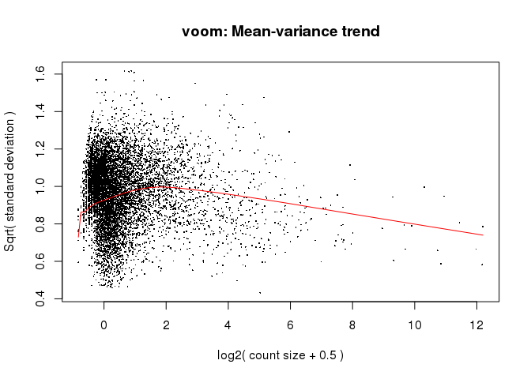 

```r
plotMDS(d)
```

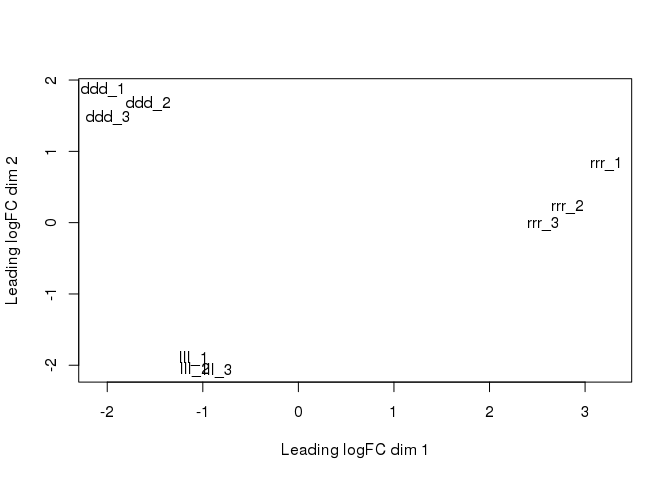 

```r
d %<>% lmFit(design) %>%
  contrasts.fit(cont.matrix) %>%
  eBayes

d$genes <- genesymbols[rownames(d),]

topTable(d, n=30)
```

```
##                                             cluster     symbol     rmsk  LNA_vs_RNA RNA_vs_DNA
## chrM:8791-8820-                     chrM:8791-8820-          .        .  1.42524429 -10.038164
## chrX:54985894-54985915+     chrX:54985894-54985915+          .   7SLRNA -9.32582244   3.132631
## chrM:3204-3328-                     chrM:3204-3328-          .        .  2.26123129 -10.548619
## chrM:7921-8495-                     chrM:7921-8495-          .        .  1.86801396  -7.696132
## chr1:94960286-94960319-     chr1:94960286-94960319-          .        .  0.56418174  -8.773566
## chr1:94959892-94959938-     chr1:94959892-94959938-          .        .  0.42482682  -8.693878
## chr10:56418700-56418703+   chr10:56418700-56418703+          .        .  1.54755005  -8.346528
## chr19:54081555-54081557+   chr19:54081555-54081557+          .        .  0.51324092  -7.519669
## chr7:1338022-1338132-         chr7:1338022-1338132- F1M1V3_RAT        .  1.55220828  -8.228931
## chrM:14633-14920-                 chrM:14633-14920-          .        .  2.88674564  -8.431173
## chr1:94960545-94960582-     chr1:94960545-94960582-          .        . -0.26371362  -8.323373
## chr10:55850760-55850809-   chr10:55850760-55850809-          .        .  0.67378536  -7.894443
## chr3:70682541-70682599+     chr3:70682541-70682599+          .   7SLRNA -8.69365985   3.032615
## chr5:5309920-5309978-         chr5:5309920-5309978-          .   7SLRNA -8.72799125   3.437860
## chr19:54084507-54084561-   chr19:54084507-54084561-      Acta1        . -9.20945553   5.812764
## chr1:94960602-94960638-     chr1:94960602-94960638-          .        .  0.51324092  -7.318463
## chrM:694-711-                         chrM:694-711-          .        .  5.30455235  -8.333904
## chr2:23416638-23416760-     chr2:23416638-23416760-          .        . -7.64415388   2.729881
## chr1:198700056-198700097- chr1:198700056-198700097-      Bnip3        . -6.72924468   6.584384
## chr1:94955085-94955198-     chr1:94955085-94955198-          .        .  1.51530361  -8.907340
## chr1:94953764-94953909-     chr1:94953764-94953909-          .        .  0.04488651  -7.693582
## chr15:3869781-3869838+       chr15:3869781-3869838+      Myoz1        . -7.35597597   6.005858
## chr7:116115085-116115118+ chr7:116115085-116115118+          .        .  0.06992660  -6.895704
## chr14:33909485-33909502+   chr14:33909485-33909502+          . (GGGTG)n  3.70967469  -7.926718
## chr8:62243583-62243658+     chr8:62243583-62243658+          .   7SLRNA -8.30447382   3.171053
## chr10:83622428-83622487+   chr10:83622428-83622487+          .        . -7.48117204   4.104534
## chr1:94955776-94955964-     chr1:94955776-94955964-          .        . -0.74259304  -7.080045
## chr6:91117279-91117393+     chr6:91117279-91117393+          .   7SLRNA -8.22635418   3.019970
## chr1:85600508-85600631-     chr1:85600508-85600631-          .        .  0.51324092  -6.792243
## chr7:1337503-1337533-         chr7:1337503-1337533- F1M1V3_RAT        .  0.82620436  -7.389160
##                           DNA_vs_LNA   AveExpr        F      P.Value    adj.P.Val
## chrM:8791-8820-            8.6129201  5.341685 257.8848 1.450550e-84 2.862501e-79
## chrX:54985894-54985915+    6.1931919  7.224116 230.2406 1.678454e-77 1.656122e-72
## chrM:3204-3328-            8.2873875  8.711808 209.0583 7.401519e-72 4.868694e-67
## chrM:7921-8495-            5.8281180 15.083184 193.8810 1.114441e-67 5.498066e-63
## chr1:94960286-94960319-    8.2093840  5.366797 168.7946 1.642613e-60 6.483033e-56
## chr1:94959892-94959938-    8.2690514  5.647083 159.2350 1.094139e-57 3.598604e-53
## chr10:56418700-56418703+   6.7989777  4.817723 155.3609 1.579334e-56 4.452347e-52
## chr19:54081555-54081557+   7.0064280  4.187579 152.3772 1.251721e-55 3.087668e-51
## chr7:1338022-1338132-      6.6767229  4.778531 147.1476 4.855899e-54 1.064731e-49
## chrM:14633-14920-          5.5444272 10.423346 144.7711 2.592955e-53 5.116912e-49
## chr1:94960545-94960582-    8.5870868  6.880121 144.5285 3.077938e-53 5.521793e-49
## chr10:55850760-55850809-   7.2206574  4.784190 143.7218 5.446818e-53 8.957247e-49
## chr3:70682541-70682599+    5.6610451  7.350670 143.1559 8.133402e-53 1.234644e-48
## chr5:5309920-5309978-      5.2901312  7.303257 142.1329 1.680987e-52 2.369460e-48
## chr19:54084507-54084561-   3.3966917  8.844940 141.4041 2.822209e-52 3.712879e-48
## chr1:94960602-94960638-    6.8052221  4.117578 137.5035 4.577238e-51 5.645422e-47
## chrM:694-711-              3.0293518  6.532793 135.1755 2.440193e-50 2.832620e-46
## chr2:23416638-23416760-    4.9142732  6.231840 133.3416 9.171678e-50 1.005517e-45
## chr1:198700056-198700097-  0.1448605  4.330226 133.2606 9.724929e-50 1.010057e-45
## chr1:94955085-94955198-    7.3920362  6.834828 131.9140 2.579864e-49 2.545539e-45
## chr1:94953764-94953909-    7.6486958  8.402042 128.0079 4.439845e-48 4.172165e-44
## chr15:3869781-3869838+     1.3501181  4.971137 126.4051 1.436749e-47 1.288757e-43
## chr7:116115085-116115118+  6.8257776  4.303312 125.8112 2.222177e-47 1.906618e-43
## chr14:33909485-33909502+   4.2170428  5.390988 120.0059 1.625059e-45 1.336198e-41
## chr8:62243583-62243658+    5.1334210  7.604320 118.9501 3.567572e-45 2.816085e-41
## chr10:83622428-83622487+   3.3766379  5.667160 118.5116 4.948331e-45 3.755764e-41
## chr1:94955776-94955964-    7.8226382  5.700428 117.1895 1.329132e-44 9.714432e-41
## chr6:91117279-91117393+    5.2063842  7.568706 116.3330 2.524804e-44 1.779437e-40
## chr1:85600508-85600631-    6.2790017  3.943830 116.2808 2.625507e-44 1.786603e-40
## chr7:1337503-1337533-      6.5629559  4.729983 116.1004 3.006096e-44 1.977400e-40
```

```r
summary(decideTests(d))
```

```
##    LNA_vs_RNA RNA_vs_DNA DNA_vs_LNA
## -1       2312      54286        408
## 0      192970     140674     195660
## 1        2057       2379       1271
```

```r
decideTests(d) %>% vennDiagram
```

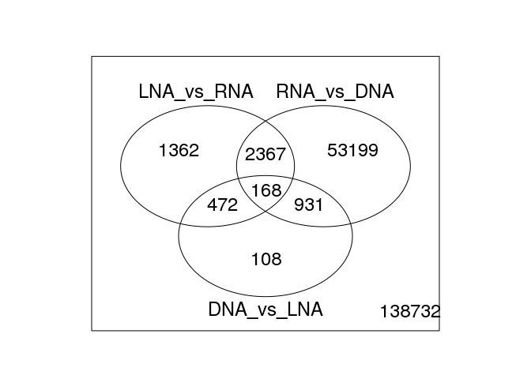 

### LNA vs RNA


```r
n <- 1
cont.matrix[,n]
```

```
## DNA LNA RNA 
##   0   1  -1
```

```r
plotMD( d, coef=n, status=decideTests(d)[,n] !=0
      , main="LNA vs RNA")
```

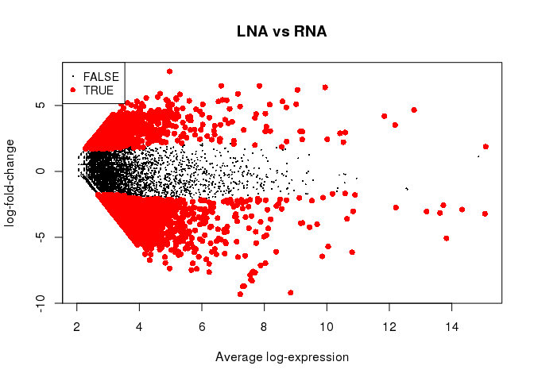 

```r
topTreat(d,n)
```

```
##                                             cluster symbol   rmsk     logFC  AveExpr         t
## chrX:54985894-54985915+     chrX:54985894-54985915+      . 7SLRNA -9.325822 7.224116 -22.37710
## chr5:5309920-5309978-         chr5:5309920-5309978-      . 7SLRNA -8.727991 7.303257 -17.33950
## chr3:70682541-70682599+     chr3:70682541-70682599+      . 7SLRNA -8.693660 7.350670 -17.24749
## chr2:23416638-23416760-     chr2:23416638-23416760-      .      . -7.644154 6.231840 -17.02479
## chr10:83622428-83622487+   chr10:83622428-83622487+      .      . -7.481172 5.667160 -16.56083
## chr19:54084507-54084561-   chr19:54084507-54084561-  Acta1      . -9.209456 8.844940 -16.40563
## chr15:3869781-3869838+       chr15:3869781-3869838+  Myoz1      . -7.355976 4.971137 -16.22769
## chr8:62243583-62243658+     chr8:62243583-62243658+      . 7SLRNA -8.304474 7.604320 -15.67272
## chr6:91117279-91117393+     chr6:91117279-91117393+      . 7SLRNA -8.226354 7.568706 -15.46489
## chr7:120223759-120223790+ chr7:120223759-120223790+   Aco2      . -6.936381 4.831355 -15.03097
##                                P.Value    adj.P.Val         B
## chrX:54985894-54985915+   5.230691e-84 1.032219e-78 178.59426
## chr5:5309920-5309978-     2.863468e-56 2.825369e-51 115.47462
## chr3:70682541-70682599+   8.752410e-56 5.757306e-51 114.37305
## chr2:23416638-23416760-   1.295040e-54 6.389050e-50 112.28622
## chr10:83622428-83622487+  3.388114e-52 1.337214e-47 106.83595
## chr19:54084507-54084561-  2.149632e-51 7.070104e-47 104.12063
## chr15:3869781-3869838+    1.771317e-50 4.993571e-46 102.96346
## chr8:62243583-62243658+   1.190588e-47 2.936868e-43  96.01944
## chr6:91117279-91117393+   1.326781e-46 2.909173e-42  93.67628
## chr7:120223759-120223790+ 1.935493e-44 3.819482e-40  89.36550
```


### RNA vs DNA


```r
n <- 2
cont.matrix[,n]
```

```
## DNA LNA RNA 
##  -1   0   1
```

```r
plotMD( d, coef=n, status=decideTests(d)[,n] !=0
      , main="RNA vs DNA")
```

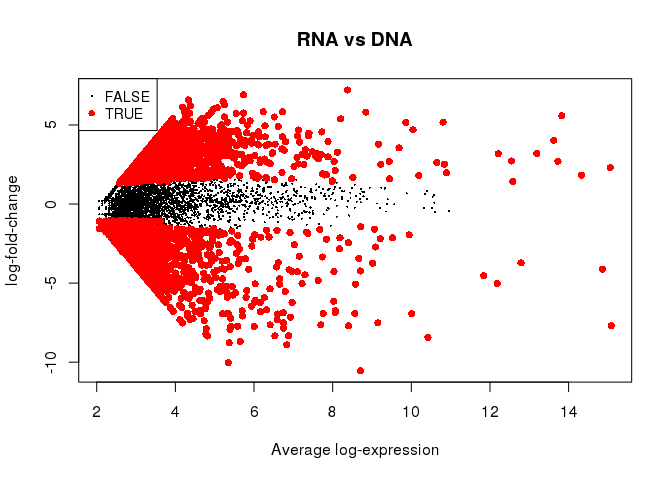 

```r
topTreat(d,n)
```

```
##                                           cluster     symbol     rmsk      logFC   AveExpr
## chrM:8791-8820-                   chrM:8791-8820-          .        . -10.038164  5.341685
## chrM:3204-3328-                   chrM:3204-3328-          .        . -10.548619  8.711808
## chrM:7921-8495-                   chrM:7921-8495-          .        .  -7.696132 15.083184
## chr10:56418700-56418703+ chr10:56418700-56418703+          .        .  -8.346528  4.817723
## chr7:1338022-1338132-       chr7:1338022-1338132- F1M1V3_RAT        .  -8.228931  4.778531
## chrM:694-711-                       chrM:694-711-          .        .  -8.333904  6.532793
## chr1:94960286-94960319-   chr1:94960286-94960319-          .        .  -8.773566  5.366797
## chr14:33909485-33909502+ chr14:33909485-33909502+          . (GGGTG)n  -7.926718  5.390988
## chrM:14633-14920-               chrM:14633-14920-          .        .  -8.431173 10.423346
## chr10:55850760-55850809- chr10:55850760-55850809-          .        .  -7.894443  4.784190
##                                  t      P.Value    adj.P.Val         B
## chrM:8791-8820-          -22.58415 3.501478e-85 6.909781e-80 180.98387
## chrM:3204-3328-          -19.19015 3.181181e-66 3.138856e-61 137.19779
## chrM:7921-8495-          -18.57478 7.091949e-63 4.665060e-58 131.23717
## chr10:56418700-56418703+ -17.67016 5.069293e-58 2.500923e-53 119.78501
## chr7:1338022-1338132-    -17.20164 1.525979e-55 6.022704e-51 114.21449
## chrM:694-711-            -16.88350 7.104026e-54 2.336502e-49 110.34562
## chr1:94960286-94960319-  -16.50247 6.793537e-52 1.915185e-47 105.59979
## chr14:33909485-33909502+ -16.46336 1.082149e-51 2.669379e-47 105.54420
## chrM:14633-14920-        -16.43727 1.475973e-51 3.236301e-47 104.96587
## chr10:55850760-55850809- -15.79031 3.023249e-48 5.966050e-44  97.68311
```


### DNA vs LNA


```r
n <- 3
cont.matrix[,n]
```

```
## DNA LNA RNA 
##   1  -1   0
```

```r
plotMD( d, coef=n, status=decideTests(d)[,n] !=0
      , main="DNA vs LNA")
```

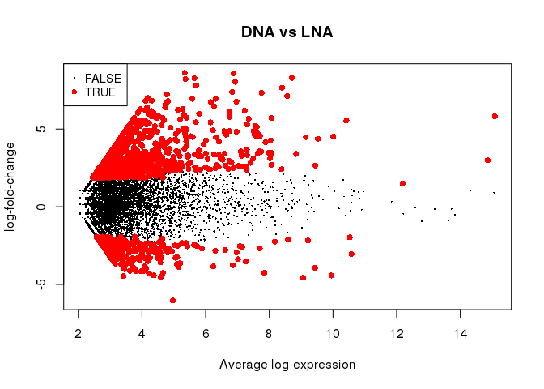 

```r
topTreat(d,n)
```

```
##                                             cluster symbol rmsk    logFC   AveExpr        t
## chrM:8791-8820-                     chrM:8791-8820-      .    . 8.612920  5.341685 16.11876
## chrM:3204-3328-                     chrM:3204-3328-      .    . 8.287388  8.711808 15.71890
## chr1:94960286-94960319-     chr1:94960286-94960319-      .    . 8.209384  5.366797 15.26667
## chr1:94959892-94959938-     chr1:94959892-94959938-      .    . 8.269051  5.647083 15.22165
## chr1:94960545-94960582-     chr1:94960545-94960582-      .    . 8.587087  6.880121 15.13177
## chr19:54081555-54081557+   chr19:54081555-54081557+      .    . 7.006428  4.187579 14.78951
## chrM:7921-8495-                     chrM:7921-8495-      .    . 5.828118 15.083184 14.76931
## chr1:94955776-94955964-     chr1:94955776-94955964-      .    . 7.822638  5.700428 14.43030
## chr7:116115085-116115118+ chr7:116115085-116115118+      .    . 6.825778  4.303312 14.20828
## chr1:94960602-94960638-     chr1:94960602-94960638-      .    . 6.805222  4.117578 14.02863
##                                P.Value    adj.P.Val        B
## chrM:8791-8820-           6.409381e-50 1.264821e-44 99.53997
## chrM:3204-3328-           6.954190e-48 6.861665e-43 95.20236
## chr1:94960286-94960319-   1.303452e-45 8.574062e-41 90.13477
## chr1:94959892-94959938-   2.185760e-45 1.078339e-40 89.58411
## chr1:94960545-94960582-   6.120772e-45 2.415734e-40 88.29970
## chr19:54081555-54081557+  3.003556e-43 9.878644e-39 85.66924
## chrM:7921-8495-           3.773958e-43 1.063927e-38 86.24588
## chr1:94955776-94955964-   1.700908e-41 4.195694e-37 81.07112
## chr7:116115085-116115118+ 2.008041e-40 4.402942e-36 79.39721
## chr1:94960602-94960638-   1.457756e-39 2.876721e-35 77.49205
```

## Differential representation analysis after removing strand invaders.


```r
# In alphabetical order
samples <- c(ddd_nw_2, lll_nw_2, rrr_nw_2)
groups  <- c(rep('DNA_nw2',3), rep('LNA_nw2',3), rep('RNA_nw2', 3))

design <- model.matrix(~0+groups)
colnames(design) <- c("DNA_nw2", "LNA_nw2", "RNA_nw2")
design
```

```
##   DNA_nw2 LNA_nw2 RNA_nw2
## 1       1       0       0
## 2       1       0       0
## 3       1       0       0
## 4       0       1       0
## 5       0       1       0
## 6       0       1       0
## 7       0       0       1
## 8       0       0       1
## 9       0       0       1
## attr(,"assign")
## [1] 1 1 1
## attr(,"contrasts")
## attr(,"contrasts")$groups
## [1] "contr.treatment"
```

```r
cont.matrix <- makeContrasts( LNA_vs_RNA = LNA_nw2 - RNA_nw2
                            , RNA_vs_DNA = RNA_nw2 - DNA_nw2
                            , DNA_vs_LNA = DNA_nw2 - LNA_nw2
                            , levels = design)

d <-  DGEList( counts = l2[samples]
             , group  = groups
             , remove.zeros = TRUE) %>%
        calcNormFactors %>%
        voom(design, plot = TRUE)
```

```
## Removing 86931 rows with all zero counts
```

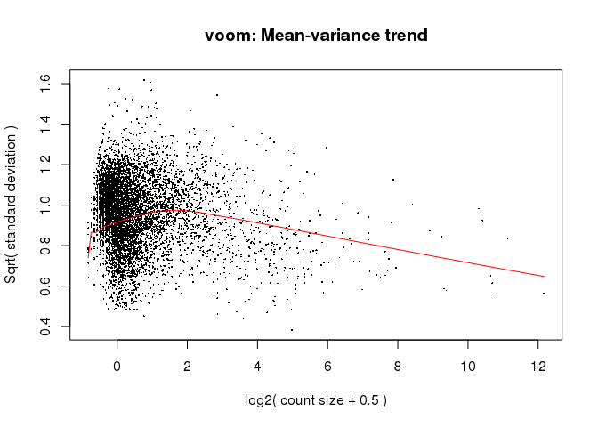 

```r
plotMDS(d)
```

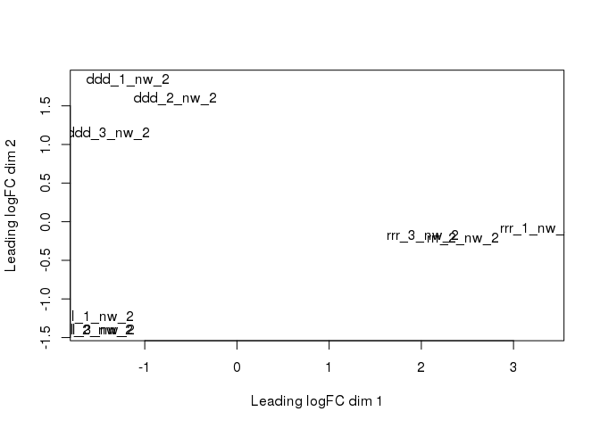 

```r
d %<>% lmFit(design) %>%
  contrasts.fit(cont.matrix) %>%
  eBayes

d$genes <- genesymbols[rownames(d),]

topTable(d, n=30)
```

```
##                                             cluster    symbol     rmsk LNA_vs_RNA RNA_vs_DNA
## chrX:54985894-54985915+     chrX:54985894-54985915+         .   7SLRNA -9.0727370   2.979478
## chrM:3204-3328-                     chrM:3204-3328-         .        .  1.9970764 -10.254041
## chr19:54084507-54084561-   chr19:54084507-54084561-     Acta1        . -8.9640252   5.652621
## chr5:5309920-5309978-         chr5:5309920-5309978-         .   7SLRNA -8.4897676   3.280413
## chr3:70682541-70682599+     chr3:70682541-70682599+         .   7SLRNA -8.4264307   2.879887
## chr2:23416638-23416760-     chr2:23416638-23416760-         .        . -7.3934607   2.572338
## chr1:198700056-198700097- chr1:198700056-198700097-     Bnip3        . -6.4718831   6.429391
## chr14:33909485-33909502+   chr14:33909485-33909502+         . (GGGTG)n  3.9901608  -8.091740
## chr15:3869781-3869838+       chr15:3869781-3869838+     Myoz1        . -7.1032715   5.859169
## chr8:62243583-62243658+     chr8:62243583-62243658+         .   7SLRNA -8.0352208   3.049711
## chrM:14633-14920-                 chrM:14633-14920-         .        .  3.1064932  -7.391665
## chr10:83622428-83622487+   chr10:83622428-83622487+         .        . -7.2316267   3.948761
## chr6:91117279-91117393+     chr6:91117279-91117393+         .   7SLRNA -7.9726178   2.862606
## chr1:85600508-85600631-     chr1:85600508-85600631-         .        .  0.7912522  -6.731551
## chr1:202745119-202745217+ chr1:202745119-202745217+         .        . -5.9846551   5.048538
## chr12:12047064-12047072+   chr12:12047064-12047072+      Actb        . -6.0265230   5.984031
## chr7:120223759-120223790+ chr7:120223759-120223790+      Aco2        . -6.6838110   5.439708
## chr9:65727648-65727774-     chr9:65727648-65727774-      Myl1        . -5.8387679   7.056381
## chr8:71357873-71358162-     chr8:71357873-71358162-      Tpm1        . -6.5051308   5.023306
## chr10:56553539-56553634+   chr10:56553539-56553634+         .        .  0.7912522  -6.532131
## chr2:77482169-77482291+     chr2:77482169-77482291+    Znf622   7SLRNA -7.6145578   3.063979
## chr2:22106037-22106057-     chr2:22106037-22106057-         .        . -6.0490855   5.584063
## chr16:10204031-10204059+   chr16:10204031-10204059+         .   G-rich  0.7912522  -6.365772
## chr1:94960602-94960638-     chr1:94960602-94960638-         .        .  0.7912522  -6.374928
## chr10:59473911-59473930+   chr10:59473911-59473930+         .   7SLRNA -7.4536982   3.029655
## chr14:33909535-33909572+   chr14:33909535-33909572+         . (GGGTG)n  0.7912522  -6.328718
## chr7:68333299-68333423-     chr7:68333299-68333423-         .   7SLRNA -7.4138388   2.990083
## chr6:91323393-91323410-     chr6:91323393-91323410-         .   7SLRNA -7.3353590   2.712320
## chr1:185975476-185975510- chr1:185975476-185975510-         .        . -7.1392569   4.843471
## chr1:187465276-187465331- chr1:187465276-187465331- CX6A2_RAT        . -5.5923251   6.067916
##                            DNA_vs_LNA   AveExpr         F       P.Value     adj.P.Val
## chrX:54985894-54985915+    6.09325897  8.154417 243.77320 1.350968e-106 2.360506e-101
## chrM:3204-3328-            8.25696469  8.633817 212.49497  5.183319e-93  4.528329e-88
## chr19:54084507-54084561-   3.31140396  9.775240 158.60449  1.315058e-69  7.659206e-65
## chr5:5309920-5309978-      5.20935455  8.233557 147.92403  5.720162e-65  2.498667e-60
## chr3:70682541-70682599+    5.54654320  8.280970 146.93498  1.537975e-64  5.374514e-60
## chr2:23416638-23416760-    4.82112256  7.162141 137.85355  1.351965e-60  3.937081e-56
## chr1:198700056-198700097-  0.04249191  5.260527 135.69893  1.166013e-59  2.910485e-55
## chr14:33909485-33909502+   4.10157937  6.320403 134.80107  2.861813e-59  6.250451e-55
## chr15:3869781-3869838+     1.24410295  5.901438 129.19707  7.770116e-57  1.508499e-52
## chr8:62243583-62243658+    4.98550966  8.511506 122.31951  7.538935e-54  1.317255e-49
## chrM:14633-14920-          4.28517134 10.715564 121.55931  1.612365e-53  2.561124e-49
## chr10:83622428-83622487+   3.28286588  6.597461 121.30145  2.086658e-53  3.038296e-49
## chr6:91117279-91117393+    5.11001199  8.499007 120.34441  5.433581e-53  7.303025e-49
## chr1:85600508-85600631-    5.94029851  4.796050 115.45191  7.242205e-51  9.038633e-47
## chr1:202745119-202745217+  0.93611730 11.687791 113.70049  4.173524e-50  4.861515e-46
## chr12:12047064-12047072+   0.04249191  5.109283 112.62450  1.224061e-49  1.336729e-45
## chr7:120223759-120223790+  1.24410295  5.761656 109.82077  2.020443e-48  2.076624e-44
## chr9:65727648-65727774-   -1.21761333  9.306983 108.20803  1.013564e-47  9.838720e-44
## chr8:71357873-71358162-    1.48182477 10.677180 107.55977  1.938141e-47  1.782345e-43
## chr10:56553539-56553634+   5.74087846  4.741240 106.71483  4.511670e-47  3.941553e-43
## chr2:77482169-77482291+    4.55057912  8.474758 104.80291  3.052634e-46  2.539894e-42
## chr2:22106037-22106057-    0.46502233  5.292559 101.13482  1.195934e-44  9.498271e-41
## chr16:10204031-10204059+   5.57451973  4.680104  99.34077  7.192000e-44  5.463637e-40
## chr1:94960602-94960638-    5.58367602  4.665233  99.21838  8.128435e-44  5.917737e-40
## chr10:59473911-59473930+   4.42404274  8.527757  98.27524  2.087395e-43  1.458897e-39
## chr14:33909535-33909572+   5.53746603  4.665997  97.73470  3.583937e-43  2.408502e-39
## chr7:68333299-68333423-    4.42375568  8.631540  96.34663  1.436117e-42  9.293647e-39
## chr6:91323393-91323410-    4.62303865  8.570057  95.44755  3.529036e-42  2.202206e-38
## chr1:185975476-185975510-  2.29578594  6.765125  95.15488  4.728884e-42  2.849185e-38
## chr1:187465276-187465331- -0.47559084  5.311547  92.98238  4.152093e-41  2.418276e-37
```

```r
summary(decideTests(d))
```

```
##    LNA_vs_RNA RNA_vs_DNA DNA_vs_LNA
## -1       2120      38570        244
## 0      165378     134194     174017
## 1        7229       1963        466
```

```r
decideTests(d) %>% vennDiagram
```

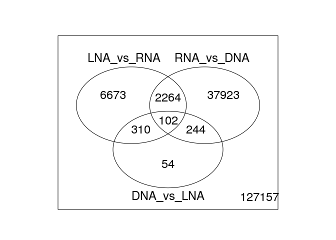 

### LNA vs RNA (filtered)


```r
n <- 1
cont.matrix[,n]
```

```
## DNA_nw2 LNA_nw2 RNA_nw2 
##       0       1      -1
```

```r
plotMD( d, coef=n, status=decideTests(d)[,n] !=0
      , main="LNA vs RNA (filtered)")
```

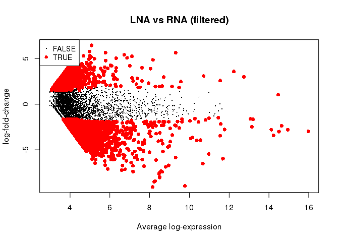 

```r
topTreat(d,n)
```

```
##                                             cluster symbol   rmsk     logFC  AveExpr         t
## chrX:54985894-54985915+     chrX:54985894-54985915+      . 7SLRNA -9.072737 8.154417 -23.05830
## chr5:5309920-5309978-         chr5:5309920-5309978-      . 7SLRNA -8.489768 8.233557 -17.62097
## chr3:70682541-70682599+     chr3:70682541-70682599+      . 7SLRNA -8.426431 8.280970 -17.41871
## chr2:23416638-23416760-     chr2:23416638-23416760-      .      . -7.393461 7.162141 -17.37663
## chr19:54084507-54084561-   chr19:54084507-54084561-  Acta1      . -8.964025 9.775240 -17.04057
## chr10:83622428-83622487+   chr10:83622428-83622487+      .      . -7.231627 6.597461 -16.85869
## chr15:3869781-3869838+       chr15:3869781-3869838+  Myoz1      . -7.103272 5.901438 -16.46312
## chr8:62243583-62243658+     chr8:62243583-62243658+      . 7SLRNA -8.035221 8.511506 -15.82815
## chr6:91117279-91117393+     chr6:91117279-91117393+      . 7SLRNA -7.972618 8.499007 -15.65994
## chr7:120223759-120223790+ chr7:120223759-120223790+   Aco2      . -6.683811 5.761656 -15.17784
##                                 P.Value     adj.P.Val        B
## chrX:54985894-54985915+   1.299264e-117 2.270165e-112 255.4117
## chr5:5309920-5309978-      1.740514e-69  1.520574e-64 145.4997
## chr3:70682541-70682599+    6.083052e-68  3.542911e-63 142.0085
## chr2:23416638-23416760-    1.267823e-67  5.538072e-63 141.8678
## chr19:54084507-54084561-   4.191025e-65  1.464570e-60 135.1717
## chr10:83622428-83622487+   9.235063e-64  2.689358e-59 133.1166
## chr15:3869781-3869838+     6.873118e-61  1.715599e-56 126.6147
## chr8:62243583-62243658+    2.020044e-56  4.411953e-52 115.9085
## chr6:91117279-91117393+    2.883111e-55  5.597304e-51 113.3079
## chr7:120223759-120223790+  5.021886e-52  8.774591e-48 106.5616
```

### RNA vs DNA (filtered)


```r
n <- 2
cont.matrix[,n]
```

```
## DNA_nw2 LNA_nw2 RNA_nw2 
##      -1       0       1
```

```r
plotMD( d, coef=n, status=decideTests(d)[,n] !=0
      , main="RNA vs DNA (filtered)")
```

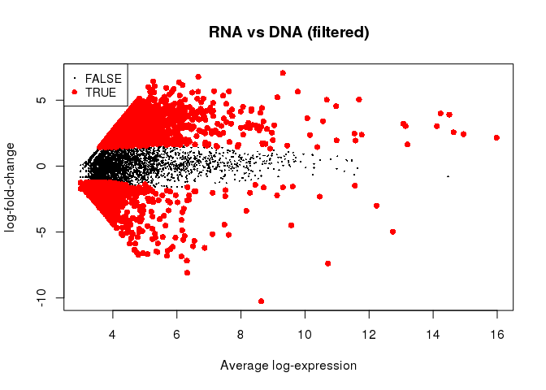 

```r
topTreat(d,n)
```

```
##                                             cluster symbol     rmsk      logFC   AveExpr         t
## chrM:3204-3328-                     chrM:3204-3328-      .        . -10.254041  8.633817 -19.43140
## chr14:33909485-33909502+   chr14:33909485-33909502+      . (GGGTG)n  -8.091740  6.320403 -17.53946
## chrM:14633-14920-                 chrM:14633-14920-      .        .  -7.391665 10.715564 -15.26564
## chr1:198700056-198700097- chr1:198700056-198700097-  Bnip3        .   6.429391  5.260527  13.97804
## chr1:159625272-159625273- chr1:159625272-159625273-  Nup98        .  -6.793220  5.690949 -13.86684
## chr1:85600508-85600631-     chr1:85600508-85600631-      .        .  -6.731551  4.796050 -13.68988
## chrM:3107-3176-                     chrM:3107-3176-      .        .  -6.668633  5.082980 -13.51472
## chr9:65727648-65727774-     chr9:65727648-65727774-   Myl1        .   7.056381  9.306983  13.45883
## chr1:94955776-94955964-     chr1:94955776-94955964-      .        .  -6.593179  4.934646 -13.33849
## chr10:56553539-56553634+   chr10:56553539-56553634+      .        .  -6.532131  4.741240 -13.18309
##                                P.Value    adj.P.Val         B
## chrM:3204-3328-           4.333587e-84 7.571947e-79 177.12484
## chr14:33909485-33909502+  7.324866e-69 6.399259e-64 143.99123
## chrM:14633-14920-         1.312489e-52 7.644239e-48 107.29618
## chr1:198700056-198700097- 2.142020e-44 9.356718e-40  89.08510
## chr1:159625272-159625273- 1.015109e-43 3.547341e-39  87.36189
## chr1:85600508-85600631-   1.176918e-42 3.427321e-38  84.96978
## chrM:3107-3176-           1.290814e-41 3.222001e-37  82.63343
## chr9:65727648-65727774-   2.753745e-41 6.014420e-37  81.67845
## chr1:94955776-94955964-   1.392841e-40 2.704076e-36  80.31968
## chr10:56553539-56553634+  1.106050e-39 1.932568e-35  78.30188
```


### DNA vs LNA (filtered)


```r
n <- 3
cont.matrix[,n]
```

```
## DNA_nw2 LNA_nw2 RNA_nw2 
##       1      -1       0
```

```r
plotMD( d, coef=n, status=decideTests(d)[,n] !=0
      , main="DNA vs LNA (filtered)")
```

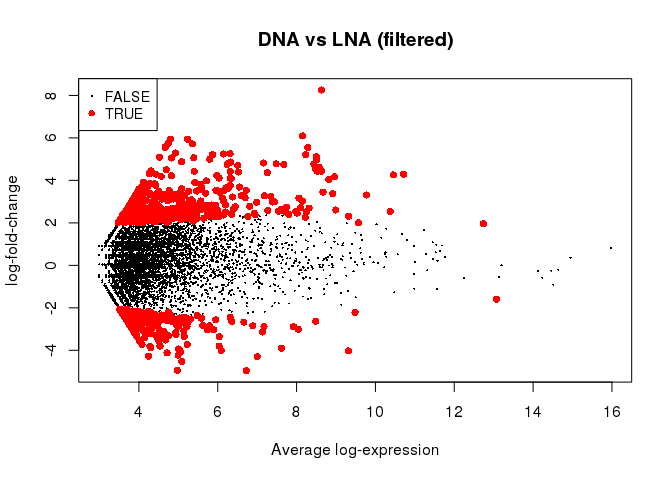 

```r
topTreat(d,n)
```

```
##                                           cluster symbol     rmsk    logFC  AveExpr        t
## chrM:3204-3328-                   chrM:3204-3328-      .        . 8.256965 8.633817 15.83730
## chrX:54985894-54985915+   chrX:54985894-54985915+      .   7SLRNA 6.093259 8.154417 12.87686
## chr1:85600508-85600631-   chr1:85600508-85600631-      .        . 5.940299 4.796050 12.46335
## chr1:94960447-94960515-   chr1:94960447-94960515-      .        . 5.928609 5.234421 12.44672
## chr10:56553539-56553634+ chr10:56553539-56553634+      .        . 5.740878 4.741240 11.94732
## chr16:10204031-10204059+ chr16:10204031-10204059+      .   G-rich 5.574520 4.680104 11.49597
## chr1:94960602-94960638-   chr1:94960602-94960638-      .        . 5.583676 4.665233 11.48928
## chr14:33909535-33909572+ chr14:33909535-33909572+      . (GGGTG)n 5.537466 4.665997 11.39550
## chr14:33910321-33910495+ chr14:33910321-33910495+      .        . 5.716784 5.356441 10.50298
## chr1:94960545-94960582-   chr1:94960545-94960582-      .        . 5.088313 4.520797 10.24621
##                               P.Value    adj.P.Val         B
## chrM:3204-3328-          1.746843e-56 3.052206e-51 112.10765
## chrX:54985894-54985915+  6.116011e-38 5.343161e-33  72.78908
## chr1:85600508-85600631-  1.189816e-35 6.401818e-31  67.75811
## chr1:94960447-94960515-  1.465559e-35 6.401818e-31  67.56509
## chr10:56553539-56553634+ 6.738009e-33 2.354624e-28  61.72168
## chr16:10204031-10204059+ 1.388104e-30 3.743757e-26  56.64563
## chr1:94960602-94960638-  1.499842e-30 3.743757e-26  56.56064
## chr14:33909535-33909572+ 4.421075e-30 9.656014e-26  55.54274
## chr14:33910321-33910495+ 8.394691e-26 1.629755e-21  45.70500
## chr1:94960545-94960582-  1.234066e-24 2.156246e-20  43.64716
```

## Session info.


```r
sessionInfo()
```

```
## R version 3.2.5 (2016-04-14)
## Platform: x86_64-pc-linux-gnu (64-bit)
## Running under: Debian GNU/Linux 8 (jessie)
## 
## locale:
##  [1] LC_CTYPE=en_GB.UTF-8       LC_NUMERIC=C               LC_TIME=en_GB.UTF-8       
##  [4] LC_COLLATE=en_GB.UTF-8     LC_MONETARY=en_GB.UTF-8    LC_MESSAGES=en_GB.UTF-8   
##  [7] LC_PAPER=en_GB.UTF-8       LC_NAME=C                  LC_ADDRESS=C              
## [10] LC_TELEPHONE=C             LC_MEASUREMENT=en_GB.UTF-8 LC_IDENTIFICATION=C       
## 
## attached base packages:
## [1] stats     graphics  grDevices utils     datasets  methods   base     
## 
## other attached packages:
## [1] edgeR_3.12.0 limma_3.26.1 oscR_0.2.0   magrittr_1.5
## 
## loaded via a namespace (and not attached):
##  [1] Rcpp_0.12.2      codetools_0.2-8  digest_0.6.8     plyr_1.8.3       formatR_0.10    
##  [6] evaluate_0.8     stringi_1.0-1    reshape2_1.4.1   data.table_1.9.2 rmarkdown_0.8   
## [11] tools_3.2.5      stringr_1.0.0    yaml_2.1.13      htmltools_0.2.6  knitr_1.11
```
