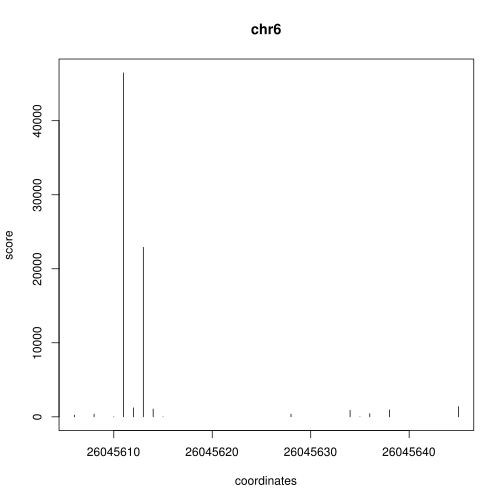

See http://dx.doi.org/10.1002/9783527644582.ch4


```bash
wget ftp://ftp.ddbj.nig.ac.jp/ddbj_database/dra/fastq/SRA003/SRA003626/SRX001881/SRR006565.fastq.bz2
bunzip2 SRR006565.fastq.bz2
```


[FASTX-Toolkit](http://hannonlab.cshl.edu/fastx_toolkit/)


```bash
fastx_barcode_splitter.pl --bcfile <(echo " Linker_found AAA") --bol --exact --prefix SRR006565. --suffix .fastq < SRR006565.fastq
fastx_trimmer -Q33 -f4 < SRR006565.Linker_found.fastq > SRR006565.trimmed.fastq
```

```
## Barcode	Count	Location
## Linker_found	1981074	SRR006565.Linker_found.fastq
## unmatched	164052	SRR006565.unmatched.fastq
## total	2145126
```


```bash
bwa aln hg19_male.fa SRR006565.trimmed.fastq > SRR006565.sai
bwa samse hg19_male.fa SRR006565.sai SRR006565.trimmed.fastq > SRR006565.sam
```


```bash
samtools view -uS SRR006565.sam | samtools sort - SRR006565
```


```bash
bedtools bamtobed -i SRR006565.bam |
  awk 'BEGIN{OFS="\t"}{if($6=="+"){print $1,$2,$2+1,$4,$5,$6};if($6=="-"){print $1,$3-1,$3,$4,$5,$6} }' |
  sort -k1,1 -k2,2n > SRR006565.bed
```


```bash
bedtools merge -n -d 100 -i SRR006565.bed |
  awk 'BEGIN{OFS="\t"}{if($4>=500){print}}' > SRR006565.mask
```


```bash
bedtools merge -s -n -d -1 -i SRR006565.bed | bedtools window -a stdin -b SRR006565.mask -w 1 -u > SRR006565.csv
```


```r
deeprace <- read.table("SRR006565.csv", col.names = c("chr", "start", "end", "score", "strand"))

with(subset(deeprace, chr == "chr6" & start > 26045605 & start < 26045646), plot(start, score, type = "h", main = "chr6", xlab = "coordinates"))
```

 

